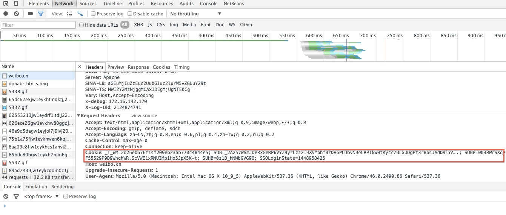

# sina-weibo-crawler

[](https://travis-ci.org/intfloat/sina-weibo-crawler)

## 抽取数据段

| 段域 | 数据类型 | 含义 | 附加说明 |
|-------------|-------------|------------|---------------|
| url | string | 主页的链接地址 | 唯一的主键 |
| nickname | string | 昵称 | |
| verify_type | string | 认证类型 | |
| verify_info | string | 认证信息 | |
| num_fans | int | 粉丝数目 | |
| num_follow | int | 关注数目 | |
| num_weibo | int | 发布微博数目 | |
| gender | string  | 性别 | |
| birthday | string | 生日 | 部分情况下新浪返回星座 |
| weibo | list | 用户所发微博 | 数组每一个元素为微博文本 |
| fans | list | 用户粉丝信息 | 每一个元素包含num_fans, url, nickname, verify_info |
| follow | list | 用户关注信息 | 每一个元素包含num_fans, url, nickname, verify_info |
| location | string | 地区 | |
| relationship_status | string | 感情状态 | |
| sexual_orientation | string | 性取向 | |
| self-intro | string | 简介 | |
| tags | list | 用户标签 | 每个元素为标签字符串 |
| good_at | string | 达人信息 | |

## 使用示例

 ```python
 # -*- coding: utf-8 -*-
from wcrawler import *

if __name__ == '__main__':
    # please change to your own cookie
    crawler = WCrawler(cookie = '_T_WM=1764ed14d4a61ef43ab86ce292307697; SUHB=0G0veCMff5FczB; SUB=_2A257Qs6KDeTxGeRP6VYZ9yrLzz2IHXVYzNLCrDV6PUJbrdAKLWvFkW1D2q2amgN3BCri-O-SXueGVG-2Rg..; gsid_CTandWM=4urb5d951ez5pXptyT36L8UMabX', \
        max_num_weibo = 10, \
        max_num_fans = 10, \
        max_num_follow = 10, \
        wfilter = 'all', \
        return_type = 'string')
    print crawler.crawl(url = 'http://weibo.cn/yaochen')
 ```

## cookie在哪儿呢？

见下图，如果还是没找到，就自行搜索。。。



## 示例输出结果

    {
    "birthday": "",
    "fans": [
        {
            "nickname": "友情岁月yet",
            "num_fans": 1,
            "url": "http://weibo.cn/u/5702694770",
            "verify_type": ""
        },
        {
            "nickname": "到达彼岸花开",
            "num_fans": 6,
            "url": "http://weibo.cn/u/5617336975",
            "verify_type": ""
        },
        {
            "nickname": "人生若只如初见1YXY",
            "num_fans": 2,
            "url": "http://weibo.cn/u/5607509991",
            "verify_type": ""
        },
        {
            "nickname": "哎呀用什么",
            "num_fans": 6,
            "url": "http://weibo.cn/u/5636209380",
            "verify_type": ""
        },
        {
            "nickname": "用户5772321448",
            "num_fans": 1,
            "url": "http://weibo.cn/u/5772321448",
            "verify_type": ""
        },
        {
            "nickname": "手机用户3179891544",
            "num_fans": 8,
            "url": "http://weibo.cn/u/3179891544",
            "verify_type": ""
        },
        {
            "nickname": "用户5778731949",
            "num_fans": 1,
            "url": "http://weibo.cn/u/5778731949",
            "verify_type": ""
        },
        {
            "nickname": "韩英3",
            "num_fans": 17,
            "url": "http://weibo.cn/u/3843188413",
            "verify_type": ""
        },
        {
            "nickname": "真叫俗",
            "num_fans": 17,
            "url": "http://weibo.cn/u/2794040045",
            "verify_type": ""
        },
        {
            "nickname": "用户5750884529",
            "num_fans": 1,
            "url": "http://weibo.cn/u/5750884529",
            "verify_type": ""
        }
    ],
    "follow": [
        {
            "nickname": "八月时光Candy",
            "num_fans": 1219,
            "url": "http://weibo.cn/u/1761028512",
            "verify_type": ""
        },
        {
            "nickname": "故宫淘宝",
            "num_fans": 325608,
            "url": "http://weibo.cn/gugongtaobao",
            "verify_type": "BLUE_V"
        },
        {
            "nickname": "魏君子",
            "num_fans": 354518,
            "url": "http://weibo.cn/weijunzi",
            "verify_type": "RED_V"
        },
        {
            "nickname": "王大陸TaluWang",
            "num_fans": 674071,
            "url": "http://weibo.cn/u/1101675253",
            "verify_type": "RED_V"
        },
        {
            "nickname": "毕飞宇",
            "num_fans": 799189,
            "url": "http://weibo.cn/bifeiyu",
            "verify_type": "RED_V"
        },
        {
            "nickname": "编剧王小平",
            "num_fans": 36213,
            "url": "http://weibo.cn/u/1150691890",
            "verify_type": "RED_V"
        },
        {
            "nickname": "英国报姐",
            "num_fans": 8274532,
            "url": "http://weibo.cn/uktimes",
            "verify_type": "RED_V"
        },
        {
            "nickname": "早稻-野獸",
            "num_fans": 183581,
            "url": "http://weibo.cn/u/1835883650",
            "verify_type": ""
        },
        {
            "nickname": "韩浩月",
            "num_fans": 52871,
            "url": "http://weibo.cn/hanhaoyue",
            "verify_type": "RED_V"
        },
        {
            "nickname": "故宫博物院",
            "num_fans": 1828048,
            "url": "http://weibo.cn/gugongweb",
            "verify_type": "BLUE_V"
        }
    ],
    "gender": "女",
    "good_at": "",
    "location": "北京 朝阳区",
    "nickname": "姚晨",
    "num_fans": 78468129,
    "num_follow": 460,
    "num_weibo": 8266,
    "relationship_status": "",
    "self-intro": "",
    "sexual_orientation": "",
    "tags": [],
    "url": "http://weibo.cn/yaochen",
    "verify_info": "演员，联合国难民署中国亲善大使。",
    "verify_type": "RED_V",
    "weibo": [
        "倍耐力年历已有50多年历史。每年只印两万本，并不出售，只供收藏。几乎每幅都是收藏级艺术人像摄影作品。2016年历邀请了当代最伟大的摄影师之一Annie Leibovitz掌镜，安妮亲自从全球各领域挑选十三位女性，为本次拍摄定义主题为：世界上最有力量的女性。[玫瑰] [位置]英国·伦敦 显示地图 [组图共9张] 原图 ",
        "2016年，倍耐力年历封面。洗尽铅华的自己，好似一位久违的老友。摄影师：Annie Leibovitz [位置]英国·伦敦 显示地图 原图 ",
        "梦见一种天气，记忆深处的，久违的。细雨、落叶、雨后绿植的清香。松弛，喜悦，平静… 原图 ",
        "晚安，我的家。[月亮][张嘴] 原图 ",
        "转发了 新浪娱乐 的微博:德普叔和卷福做客《格莱厄姆·诺顿秀》，卷福现场模仿起起了水獭，表情太魔性！[哈哈] 最后上来的大熊更被卷福扑倒后暴打[笑cry] [组图共6张]转发理由:我福戏外就是一枚蛇精病！[蛇][哈哈][爱你]  ",
        "转发了 时装LOFFICIEL杂志 的微博:波谲云诡的城市变化莫测，如同她。眉宇间不言不语，只在眨眼已万千思索过隙。选择拥有，选择游刃有余，选择成为一颗硕果。L'OFFICIEL TV 黑白映画，让你看清「一切都好」的@姚晨 。http://t.cn/RUdwziG 转发理由:[张嘴]  ",
        "转发了 韦韦来 的微博:Hi，@姚晨 ！@张晶LOFFICIEL @开海 @张梦音 @刘雪亮MQstudio @张蕾 [组图共7张]转发理由:重逢@韦韦来 。[爱你][张嘴]  ",
        "转发了 电影一切都好 的微博:#电影一切都好# 在外工作的你，跟父母多久通一次电话呢？长大之后的你，是否能和父母愉快的聊天？和父母的每一次电话，能超过三分钟么？《一切都好》通话三分钟视频特辑，带你感受亲情的温暖[爱你][爱你] @导演张猛 @张国立 @姚晨 @窦骁 @陈赫 @叶一云 http://t.cn/RUrZHOH 转发理由:就记得以前通电话，我还没来得及说再见，我爸就匆匆挂了电话，因为他总是很忙。自打退休以后，他老在电话里抓着我聊个没完，通话时间都在半小时以上…[电话]️  ",
        "转发了 看电影周刊 的微博:#原创# [幽灵公主]。图片作者新加坡艺术家Ignatius Tan，出处http://t.cn/RUBloKR。转发理由:转发微博  ",
        "转发了 联合国难民署 的微博:全球约1500万难民，一半是儿童。他们大多生活在没有电的难民营，有诸多不便和安全隐患。由宜家基金会发起的“点亮难民生活”活动近期将再次启动。自14年起，40个国家的爱心人士通过在宜家购买灯泡向难民营的孩子和家庭筹集共1080万欧元。您的帮助将为那些在亚洲、非洲和中东地区难民营的家庭带来光明。转发理由:[鲜花]  "
    ]
    }

## FAQ

### 1.爬取大量数据会不会被新浪封禁账户？

会的。我只碰到临时封禁的情况，过段时间自动解禁，建议注册马甲。

### 2.不要爬取所登录账户的微博数据！！网页结构不一样，会挂掉的。

### 3.提供的WCrawler.crawl() API只能爬取一个用户的微博信息，这有什么卵用？

并不是这样。。。
`WCrawler.crawl()`只需要一个`url`参数，返回的用户粉丝、关注里面都有`url`，
可以向外扩展爬取，并且也可以自定义一些过滤规则。

比如，下面的代码实现了功能：

把姚晨作为初始种子用户，
沿着用户的关注链爬取用户数据，
过滤掉不是红V认证的，每个用户爬取至多10条微博文本、至多20个关注者、不爬取任何粉丝信息。

```python
# -*- coding: utf-8 -*-
from wcrawler import *

if __name__ == '__main__':
    # set to your own cookie
    crawler = WCrawler(cookie = '_T_WM=e4012b8a3c24584e9ea7de13e75d4bb; SUB=_2A257kOheRxGP6VYZ9yrLzz2IHXVZeogrrDV6PUJbstBeLXnekW1LHetBZhAVWEBBZSXv3SN2ikAIWTB36w..; SUBP=0033WrSXqPxfM725Ws9jqgMF55529P9D9WhhWR.ScVWE1xRNUIMpo5JpX5o2p; SUHB=09P8xGOWDSAKsH; SSOLoginState=1452578867', \
        max_num_weibo = 10, \
        max_num_fans = 0, \
        max_num_follow = 20, \
        max_num_page = 10, \
        wfilter = 'all', \
        return_type='json')

    queue = ['http://weibo.cn/yaochen']
    visited = set()
    while len(queue) > 0:
        url = queue[0]
        queue = queue[1:]
        if url in visited:
            continue
        json_data = crawler.crawl(url)
        visited.add(url)
        queue += [user['url'] for user in json_data['follow'] if user['verify_type'] == 'RED_V']
    pass
```
